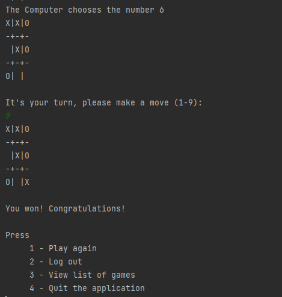

# Console-based Tic-Tac-Toe game for two players.
The user plays against the computer that chooses moves using a random number generator. 

Game rules:
https://www.merriam-webster.com/dictionary/tic-tac-toe#:~:text=%3A%20a%20game%20in%20which%20two,Os%20before%20the%20opponent%20does

At the start of a program user must login by enter a nickname.
When user logs in for the first time - program must ask to enter name and age.
This information must be stored in a database.

When the game starts, program must display the board with possible moves. The user (1st player) must choose a number from the board to make a move. 
In the chosen position must appear "X".
After the 1st player move, the program must display the board again and a computer (2nd player) generates a random number for a move. 
In the chosen position must appear "O".
The process must proceed until one of the players wins or the board is filled up (indicating that a tie occurred).
At the end of the game, the program announces the winner and display action menu:
1. Play again
2. Logout - if user selects this option, then another user may login.
3. List all moves of this user game. (show all existing games first then user can select one game to see all moves).
4. Exit program.

Console output example:

